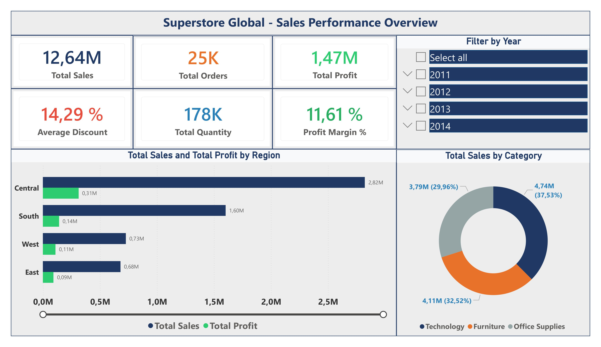
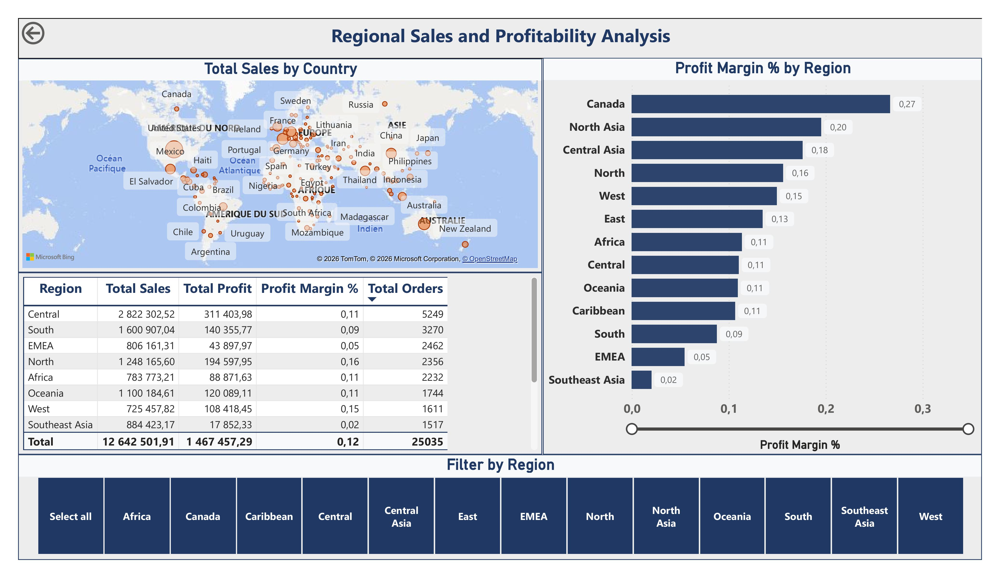

# 📊 Superstore Global - Sales Performance Dashboard
Power BI | Data Analysis | Business Intelligence

---

## 📌 Project Overview

This project delivers an interactive sales performance dashboard for a global retail company, the Superstore, covering four years of transactional data (2011-2014) across multiple regions, product categories, and 51,290 order lines.
Built entirely in **Power BI**, the project follows a full analytical pipeline from data preparation to interactive dashboard design and business recommendations.

The objective is to provide decision-makers with a **clear, actionable view** of sales performance, regional profitability, discount impact, and seasonal trends.

---

## 🗂️ Dataset

**Source:** [Global Superstore Dataset - Kaggle](https://www.kaggle.com/datasets/apoorvaappz/global-super-store-dataset)

- 51,290 transaction lines
- Coverage across multiple regions worldwide
- Period: 2011 - 2014

---

## 🛠️ Tools and Skills Demonstrated

| Skill | Detail |
|---|---|
| **Data preparation** | Power Query cleaning and transformation |
| **Feature engineering** | Discount Group, Month, Year columns |
| **DAX measures** | Total Sales, Profit, Margin, Orders |
| **Interactive dashboard** | 5 pages with slicers and filters |
| **Business communication** | Actionable insights per page |

---

## 📊 Dashboard Structure

### 🏠 Page 1 - Overview
> Global KPIs and high-level performance summary

- Total Sales, Total Profit, Profit Margin
- Total Orders, Total Quantity, Average Discount
- Sales and Profit by Region
- Sales by Category

---

### 🌍 Page 2 - Regional Analysis
> Deep dive into regional and geographic performance

- Interactive world map with sales bubbles
- Profit Margin by Region
- Regional performance summary table
- Filter by Region

---

### 📦 Page 3 - Category Analysis
> Product category and sub-category performance

- Sales and Profit by Sub-Category
- Profit Margin by Category
- Scatter Plot Sales vs Profit
- Filter by Category

---

### 💸 Page 4 - Discount Impact
> Impact of discounting on profitability

- Profit by Discount Group
- Scatter Plot Discount vs Profit Margin
- Area Chart Sales vs Profit by Discount Group
- Filter by Category

---

### 📅 Page 5 - Time Trends
> Sales and profit trends over time

- Monthly Sales and Profit trends
- Yearly Sales and Profit comparison
- Monthly Profit Margin trends
- Filter by Year, Region and Category

---

## 🔍 Key Findings

### 🌍 Regional Performance
- Significant profitability gaps across regions
- Some regions generate high revenue but low margins
- Geographic map reveals untapped market opportunities

### 📦 Category Performance
- Technology generates the highest profit margins
- Furniture shows structurally low profitability
- Several sub-categories are loss-making

### 💸 Discount Impact
- Discounts above 20% generate net losses
- High discount groups destroy profitability
- No discount generates the highest margins

### 📅 Seasonal Trends
- Clear seasonal patterns in sales and profit
- Significant gaps between best and worst months
- Yearly growth visible across the period

---

## 💡 Business Recommendations

| Priority | Action |
|---|---|
| 1 | Cap all discounts at 20% |
| 2 | Apply category-specific discount limits |
| 3 | Audit low-margin regions |
| 4 | Leverage best-performing months |
| 5 | Focus recovery on loss-making sub-categories |

---

## 📝 Summary

This project demonstrates a full analytical workflow from raw data to interactive business dashboard.

> The central insight is that **excessive discounting is the
> primary driver of profit leakage** across all regions
> and categories.

Targeted pricing adjustments and seasonal strategies could significantly improve profitability without increasing customer acquisition costs.

---

## 👤 Author

**Handahamé DIA** - Quantitative Economist | Sales and Data Analyst

